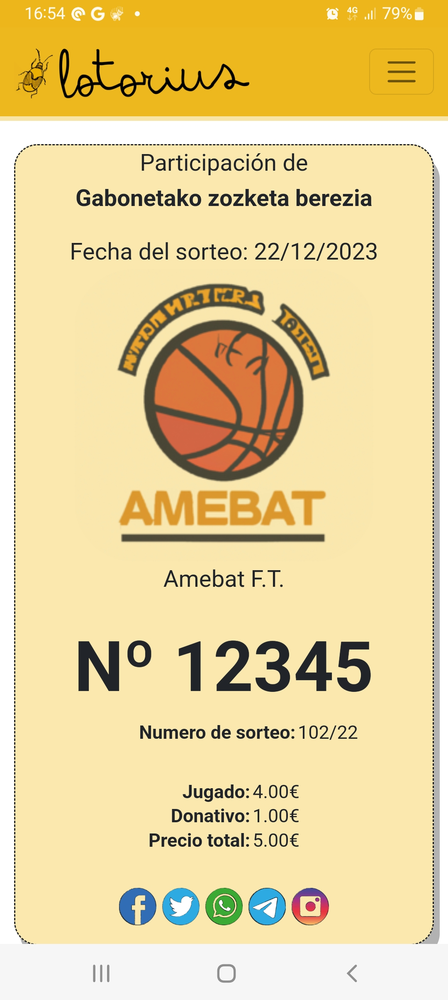
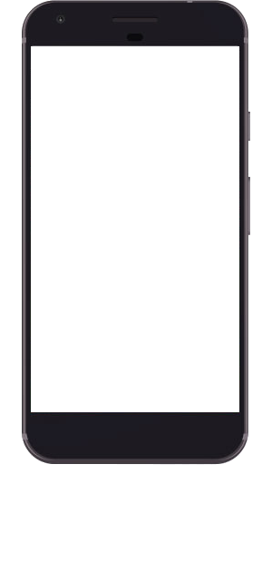

# PHONE SCREEN

## Help

phone-screen

    Usage: phone-screen [OPTS...] SCREENSHOT
    
    Embed screenshot in a phone frame and output a SVG. Supported
    frames are: "x49tf".
    
        -H        : Put the svg between "<html><body>".
        -f FRAME  : Set the frame.
        -w WIDTH  : SVG width.
        -o OUTPUT : Output filename.

## Example:

Executing the following.

    > phone-screen -o example-o.svg example-i.jpg

<table>
  <tbody>
    <tr>
      <td>  </td>
      <td> <h1>→</h1> </td>
      <td>  </td>
    </tr>
  </tbody>
</table>

## Collaborating

For making bug reports, feature requests and donations visit
one of the following links:

1. [gemini://harkadev.com/oss/](gemini://harkadev.com/oss/)
2. [https://harkadev.com/oss/](https://harkadev.com/oss/)
